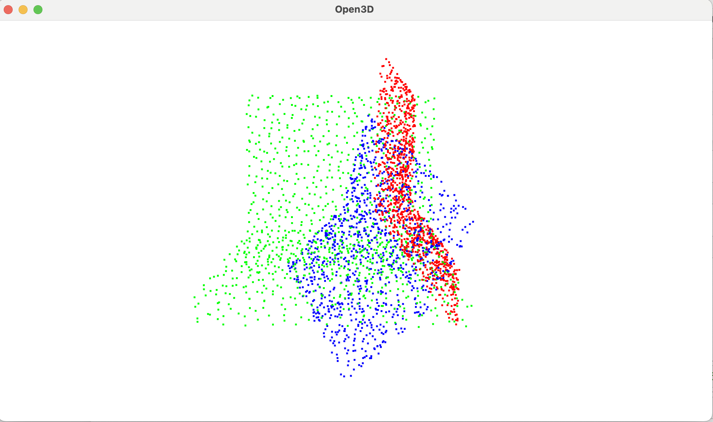
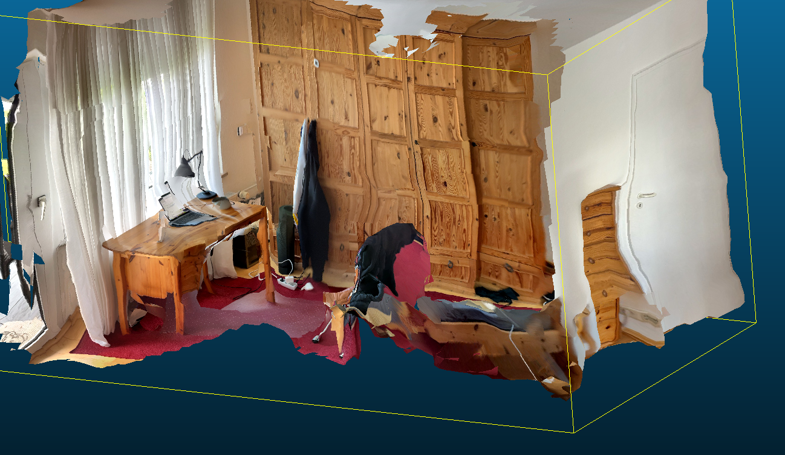
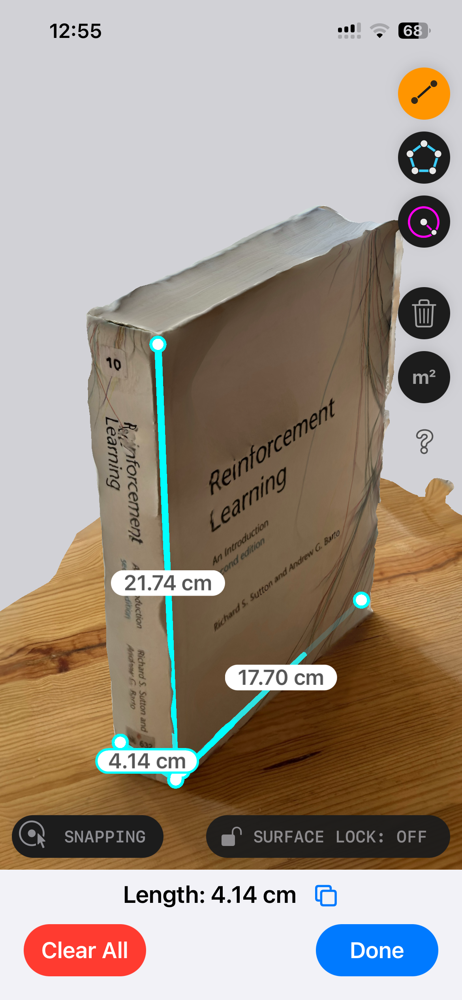
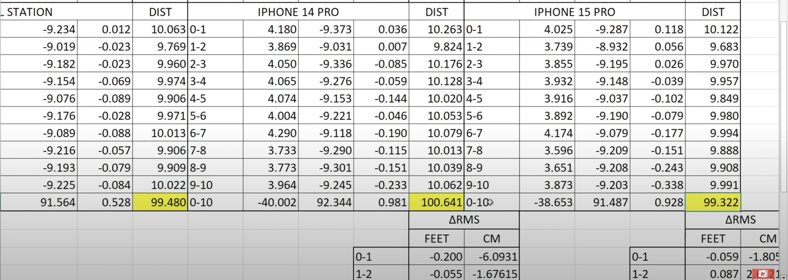
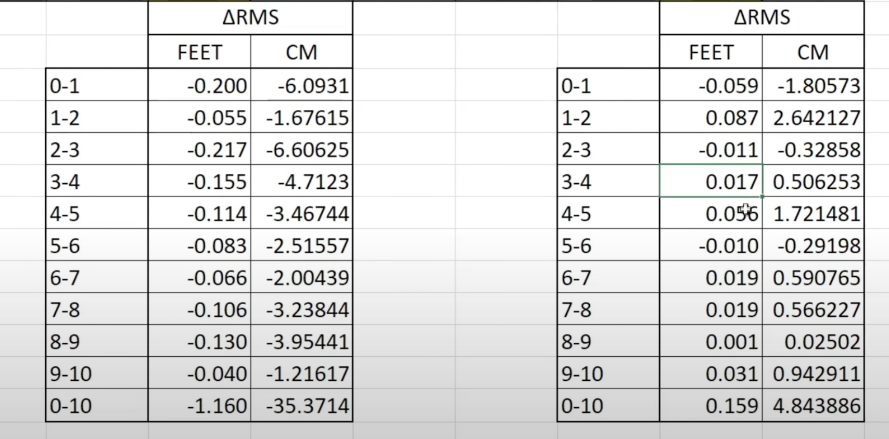

# Updates
## Week 23: 03.06.24 - 09.06.24
### Dmitrii
#### Meshes/PCs comparisons
1. For the **laptop model** (as the easiest one, just 2 surfaces) I extracted point clouds (if needed, e.g. for target mesh).
2. Then I needed to **align** these as much as possible. To account for scale difference, I just found a scaling factor between source and target PCs and multiplied by it)
3. Then I need to align the source and target model. For this I tried 2 approaches:
   - **ICP** (iterative closest point)
   - **PointNetLK** - an NN for PC registration (finding the best Rotation + translation)
   
   - I also tried to use **other PC registration models from the learning3d** repository, but for some reasons (mainly the problems when loading weights) I could not infer them

Both of working approaches does not provide good results when I want to align ModelNet40 laptop PC with a PC samples from ParaHome laptop (screenshot: red - result; green - target; blue - starting position), even while PointNetLK works smooth on ModelNet40 test dataset.
4. **Calculating distances between PCs** (hasn't started yet, but it's easy after solving the problems before)

**Questions:**
1. Does anyone know what might be the problems when dealing with models trained on one PCs dataset (e.g. ModelNet40), 
but inferencing them on another one? Like maybe some preprocessing etc., because I've encountered similar behaviour 
with embeddings (bad similarities on out of training dataset data)?
2. Maybe anyone has already worked with registration networks and can recommend some repos where the models 
would hopefully be working (except for learning3d)?

#### Sensors
1. **Separate sensor/lidar**:
   - Asked Lieske and Haschke, they possess only a Kinect v1 which is already a bit old and uses infrared projector
   and infrared camera to measure depths. Decided not to use them.
2. **Binocular depth**: I made several scans on my iphone 14 to look at the quality.
   - Scan of the room:
   
   - Book scan with dimensions (the error of measurments is about 10%)
   
   Overall I think that binocular depth estimation works bad just looking at the scan of my room.
   We should not use it for our purposes.
3. **Iphone Lidar**: I found a [sketchfab](https://sketchfab.com/3d-models/room-scan-iphone-13pro-max-lidar-scan-test-117d14015bc645d2810749ee840cc2a9)
room model made on iphone 13 pro max lidar and it looks quite good (at least in comparison to binocular depth).
   - Found [this video](https://www.youtube.com/watch?v=tk3Y3i3flzs) explaining the absolute and relative linear errors of 
   two iphones (14 pro and 15 pro) in comparison with a total station. Here are the results:
   The errors in distance estimation between several points each at the distance of 4 foots (~ 120 cm.)
   This means that an iphone pro is able to achieve the accuracy of ~1-2 centimeters per 120 cm.
   Absolute errors:
   
   Relative errors:
   
