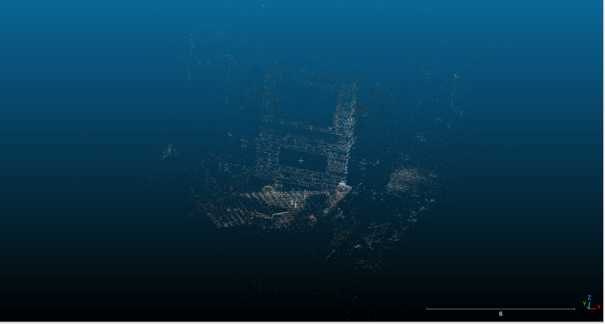

# Week 26 (24.06.2024 - 30.06.2024):
## [4D Gaussian Splatting for Real-Time Dynamic Scene Rendering](https://arxiv.org/abs/2310.08528)
### Video
Took ~20 seconds from this [video](https://www.youtube.com/watch?v=OBtGcGHLX2I&t=160s) starting from 2.40 
### COLMAP SfM
Frames extraction: ~5 FPS (actually possible to take more).

Camera information extraction (extrinsics): [nerfstudio](https://docs.nerf.studio/quickstart/installation.html)

### Resulting splatting
Training time: ~40 minutes

Result:
[Video](../data/video_rgb_stat.mp4)
### P.S: main points
1. Pretty easy to use framework (but we have problems with /homes directory ROM)
2. Setting up takes time but the tutorials are easy to use
3. Easy to use your own datasets/videos etc.
4. We can get a scene reconstruction in a video, but what do we want to do with it?
   - Possible to get all point clouds for all timestamps
   - ?