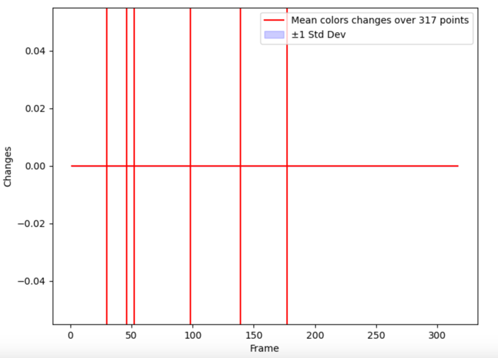

# Week 28 (08.07.2024 - 14.07.2024):
## [4D Gaussian Splatting for Real-Time Dynamic Scene Rendering](https://arxiv.org/abs/2310.08528)
1. By default the [export_perframe_3DGS.py](https://github.com/hustvl/4DGaussians/blob/master/export_perframe_3DGS.py) 
script exports only test Gaussians (those where `camera_idx % 8 == 0`, so each 8th). To analyze we rather need 
sequentially exported Gaussians.
2. After the export, I looked at one of the timestamps' Gaussians in Blender and chose a subset of Gaussians that are
supposed to be at the place of the dishwasher in video:

3. I exported the [vertices indices](../data/week28/gaussian_vertices.txt) to look at their color/position changes in python.
4. I measures the mean + std changes in the positions of these Gaussians and found several peaks which correspond
to the most seemable changes in the dishwashers Gaussians in the video:

Here are **corresponding frames (30, 46, 52, 98, 139, 177)**:

5. So we can see that the changes in positions do really correspond to the changes in the video.
6. Colors of the Gaussians did not show any changes through all the timestamps:

Code with analysis can be found [here](../data/week28/Week28%20Gaussians%20flickering.ipynb)

### Conclusion
Actually this behaviour could be already predicted if I did not forget that the network actually just predicts ONLY 
Gaussian's **position, rotation and scaling.** Colors must be already fixed in 3DGS training step:

## [2D Gaussian splatting for Geometrically Accurate Radiance Fields](https://github.com/hbb1/2d-gaussian-splatting/tree/main)
Results for the static home scene:
1. [Colored home static scene](../data/week28/render_traj_color.mp4)
2. [Depth home static scene](../data/week28/render_traj_depth.mp4)
3. 

### Conclusion
1. Consistency is bad for the views that were not presented in the video.
2. A lot of flickering and empty space
3. For some reason the .ply model is not consistent with what I get in the videos at all.
