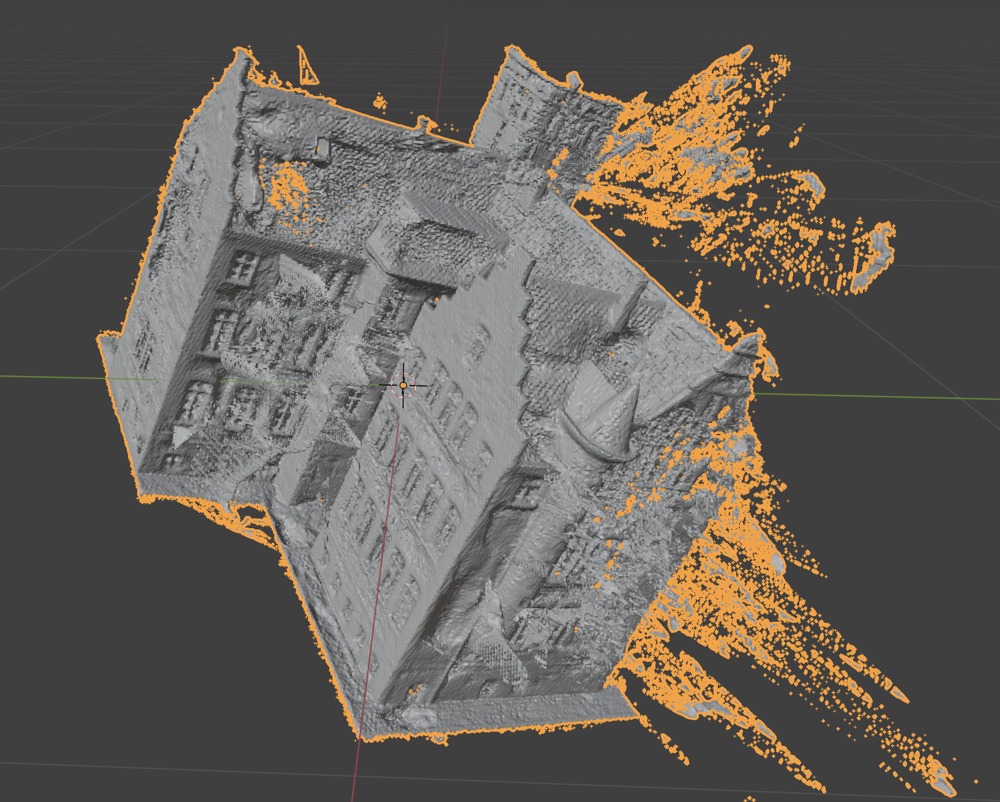
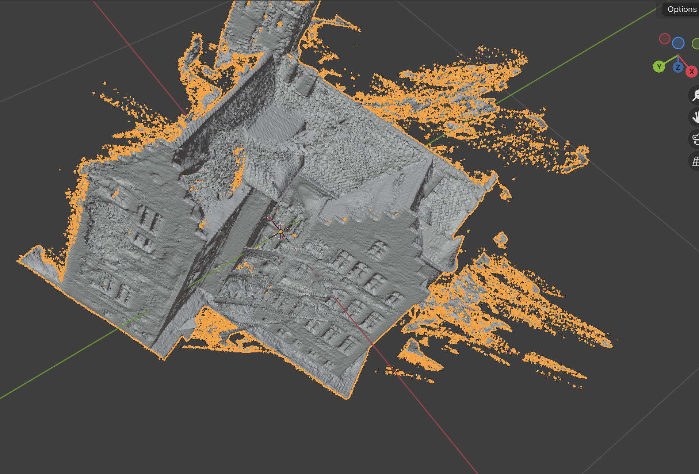
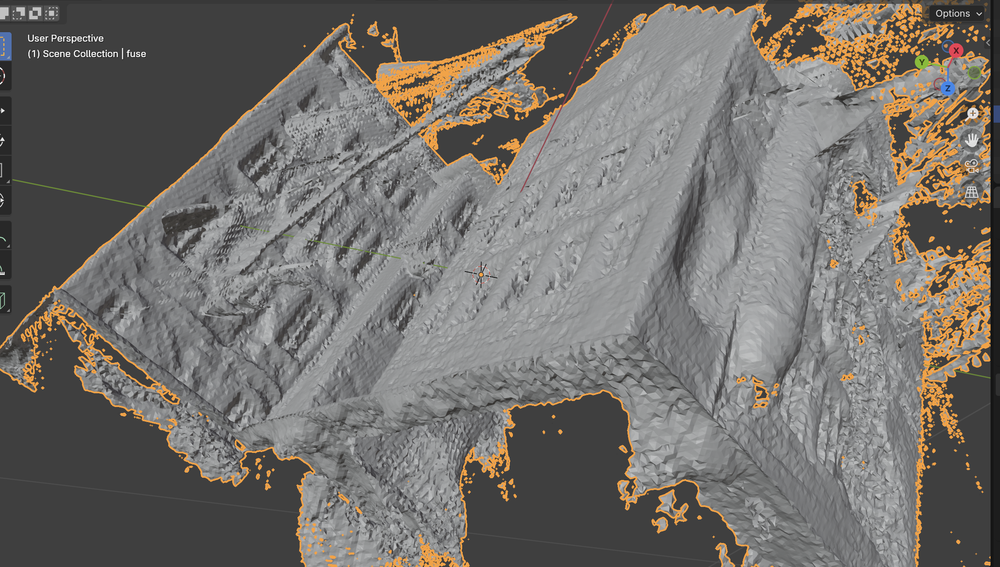

# Week 29 (15.07.2024 - 21.07.2024):
## [4D Gaussian Splatting for Real-Time Dynamic Scene Rendering](https://arxiv.org/abs/2310.08528)
To render only a subset of Gaussians as point clouds in a video it makes sense to start with the following pipeline:
1. In `render.py` find the place where Gaussians are being rendered on each timestamp.
2. Try to change the code so that only needed Gaussian vertices are rendered (e.g. those whose indices we supplied).

Here is what I got with this approach:
1. [Gaussians moving bins](../data/week29/gaussians_moving.mp4)
2. [Gaussians moving chair](../data/week29/gaussians_moving_chair.mp4)

In this first two cases I did not change the scales of Gaussians, but we still can see how they behave.
Moreover, I tried to scale them down by the factor 0.5:
3. [Gaussians moving chair (scale=0.5)](../data/week29/gaussians_moving_chair_scale_0_5.mp4):

### Conclusion: I'm sure Blender won't provide better results here, scaled Gaussians already give some information about
their movements. Depends on what we want to achieve with it.

## [2D Gaussian splatting for Geometrically Accurate Radiance Fields](https://github.com/hbb1/2d-gaussian-splatting/tree/main)
I had to try to train a static scene from a dataset. Here is the same scene from DTU dataset that Alexander took for
his 2DGS paper/repo:
1. [Video rendering](../data/week29/render_traj_color.mp4)
2. [Video depth](../data/week29/render_traj_depth.mp4)
3. Screenshots:

