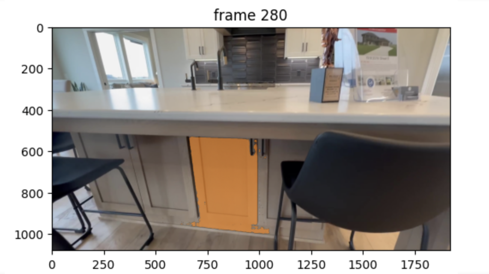
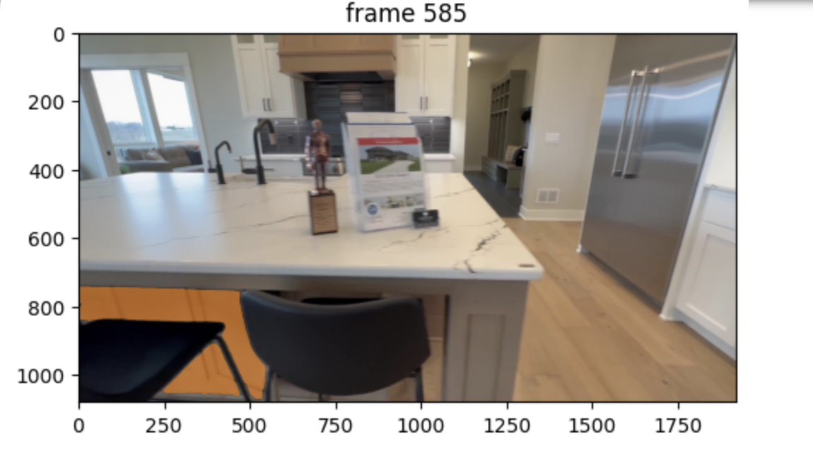
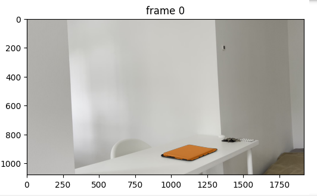
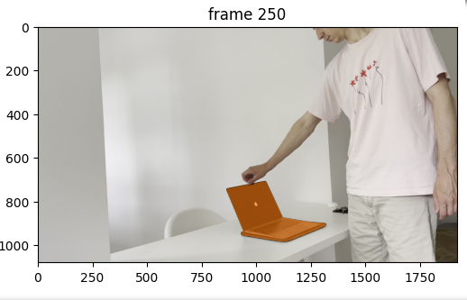
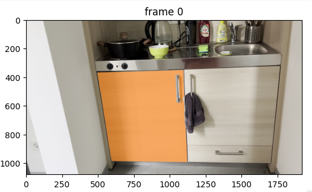
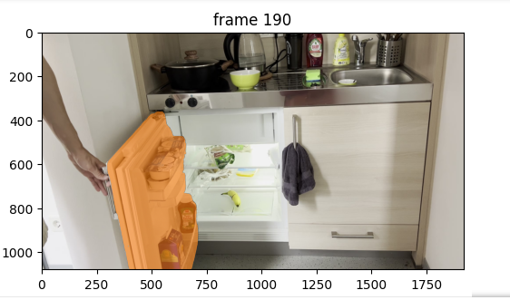
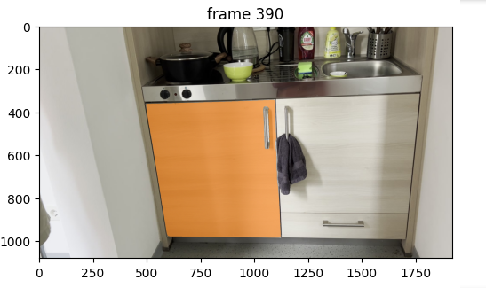

# Week 33 (12.08.2024 - 19.08.2024):
[Accompanying notebooks](../data/week33/notebooks/sam2)
## Steps
1. phase 1: scan a static environment with a monocular camera and create a 3DGS model
   - Problem: Disk IO on minecraft (reboot?)
2. phase 2: fix the camera (static view), open an articulated object (human demonstration).
   - Done: [videos](../data/week33/videos)
3. phase 3: try optic-flow and [segment-anything-v2](https://ai.meta.com/sam2/) to identify the articulated part of the object (door)
   - Tried (results below) 
3. phase 3: try 6-d tracker (requires mask of an object to track in 1st frame) to predict 6d (pos, rot) movement of the articulated object
[BundleSDF: Neural 6-DoF Tracking and 3D Reconstruction of Unknown Objects](https://bundlesdf.github.io/)
   - Question 1: the method needs an RGBD camera
   - Question 2: do we really need to estimate the pose? Won't it be enough just to create digital twin/add an object?
   - Question 3: do we really need to create twins at all? Won't just some classification + existing model help?
4. phase 4: predict the rotation/movement axis and crate the model of the object (or a batch of proposals)
5. phase 5: improve the model by / select best proposal based on photometric loss
6. phase 6: improve the 3DGS model based on new frames from opening demonstration.
## SAM 2
**Main properties:**
1. Requires a prompt (positive/negative points, bounding box) of what to segment and track.
   1. Idea: prompt could be extracted from e.g. optical flow. Problem: the one who moves the object will also be in this
    optical flow.
2. If the articulated object is relatively small on the starting frame and there are similarly looking
object around (e.g. doors), can make mistakes:

3. We can't "track back" the chosen object (i.e. we can use the mask only for the future images).
4. Is it possible just to track all the objects throughout the whole sequence?

Other examples:
**Laptop opening:**

**Fridge opening and closing**:

**Approach 1:**
1. Segment the whole image
2. Calculate the changes in the masks to define the mask of the moving object

**Notes/Problems:**
1. The more masks you try to propagate throughout the video, the more VRAM it takes. For 23 masks in the fridge the
minecraft server crashes because it lacks memory (for the laptop with 11 initial masks it works).
2. SAM2 uses FlashAttention (TODO: look up) which is disabled because of the GPU on minecraft. This could be the reason
behind point 1.
3. **Idea:** utilize masks' central point movement to check that the segment moves. **Problem:** if we try to detect 
the movement with the use of the mask center point, it does not work because the appearance of a human changes intersecting masks 
significantly.
4. **Idea:** utilize bounding box changes to detect moving segments. **Problem:** don't have a good metric to separate persons
and objects movement. Every time the object that have the largest bbox displacements are the ones that got occluded by
the moving person.
