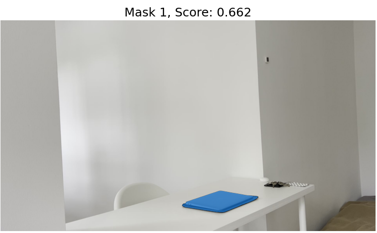
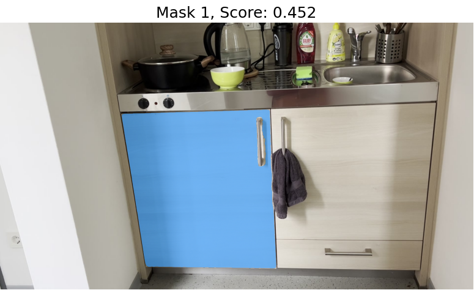

# Week 34 (19.08.2024 - 25.08.2024):
## Automatic segmentation of the interactable part
1. Original [SAM](https://github.com/facebookresearch/segment-anything/tree/main) does not provide a [language prompt
possibility](https://github.com/facebookresearch/segment-anything/issues/4). However, there is 
[a lang-sam library](https://github.com/luca-medeiros/lang-segment-anything?tab=readme-ov-file) 
that allows to do this. The masks are relatively good:
    - "laptop"
   
    - "fridge's door with it's handle"
   
2. Based on these, we can proceed with SAM 2 to segment these objects in a video:
   - [Laptop](../data/week34/laptop.mp4)
   - [Fridge](../data/week34/fridge.mp4)
3. [Hand object detector](https://github.com/ddshan/hand_object_detector/tree/master) based automatic definition.