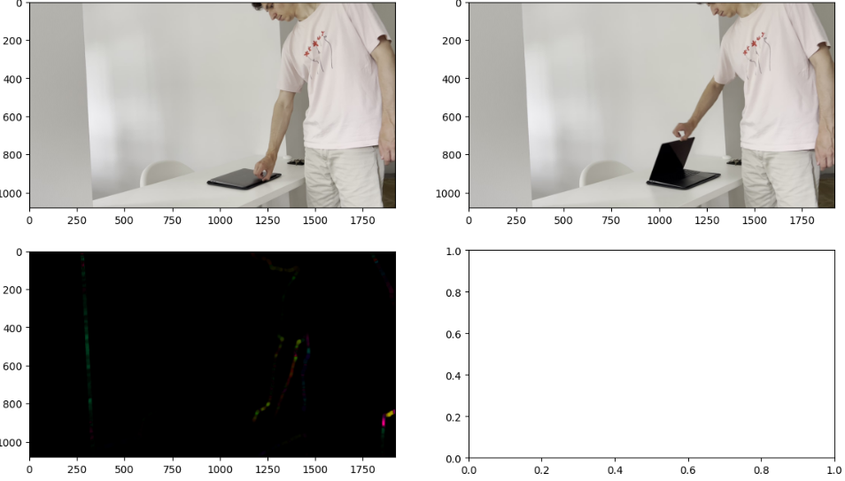
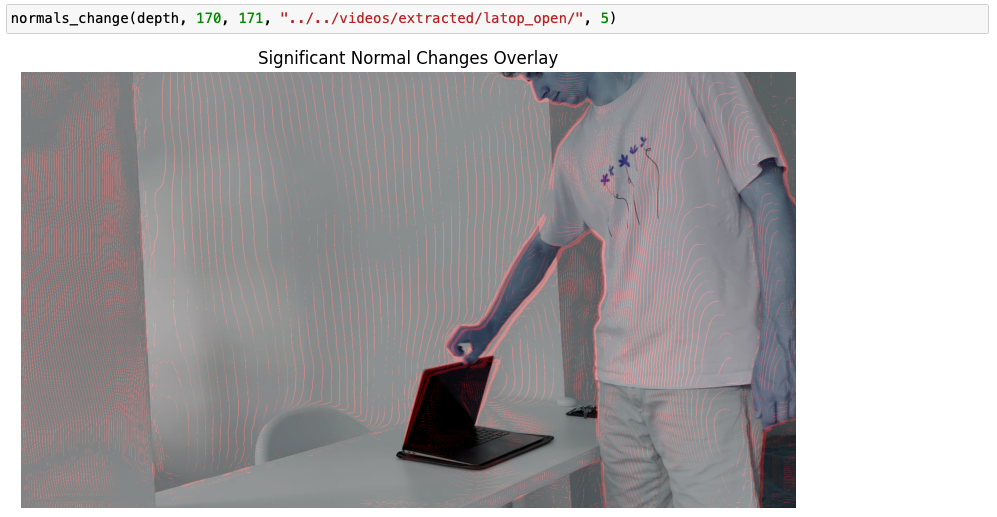
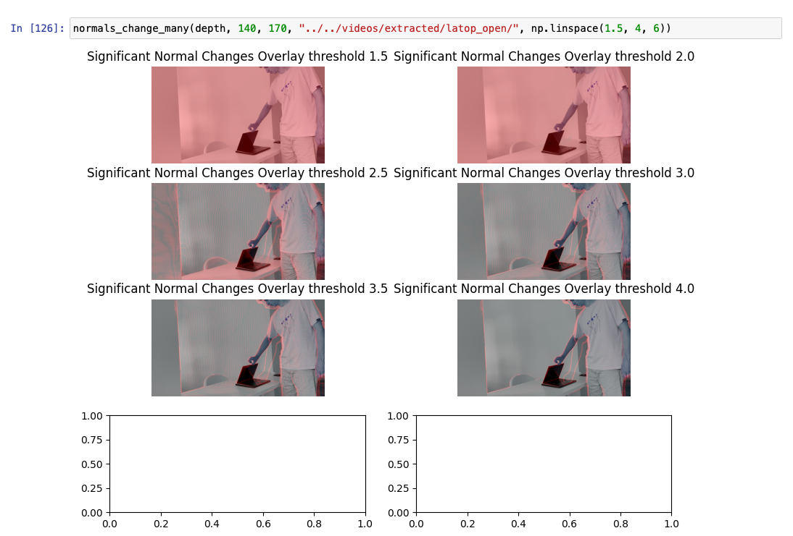

# Week 35 (26.08.2024 - 01.09.2024):
## [Grounded SAM 2](https://github.com/IDEA-Research/Grounded-SAM-2/tree/main)
- Has automatic [tracking by lang prompt](../data/week35/grounded-dino-v2/track_one)
  - Problem - while tracking one object the resolution is not low enough (e.g. "laptop's lid" will track the laptop and
  not the lid).
- Has automatic [tracking of multiple objects by prompt](../data/week35/grounded-dino-v2/track_multiple)
  - Problem - often marks the same objects [several times](../data/week35/grounded-dino-v2/track_multiple/refridgerator.mp4)
  - Sometimes works nice ([laptop](../data/week35/grounded-dino-v2/track_multiple/laptop_grounding_dino_v2.mp4)).

**Conclusion:** the resolution of segmentation is not enough/the language prompt can not be adapted to moving parts.

## [Depth Anything](https://github.com/LiheYoung/Depth-Anything/tree/main)
[Example videos with depths](../data/week35/depth-anything)

- Optical Flow (diff - 30 frames, [cv2.calcOpticalFlowFarneback](https://www.geeksforgeeks.org/opencv-the-gunnar-farneback-optical-flow/))
  - 
  - We see only sparse edges of the laptop's lid
- Changes in normals (30 frames diff, some threshold)
  - 
  - 
  - Very hard to automate, thresholds are changing drastically.
- Normal's vector fields
  - [Laptop video](../data/week35/depth-anything/laptop_vf.mp4)
  - [Fridge video](../data/week35/depth-anything/fridge_vf.mp4)
